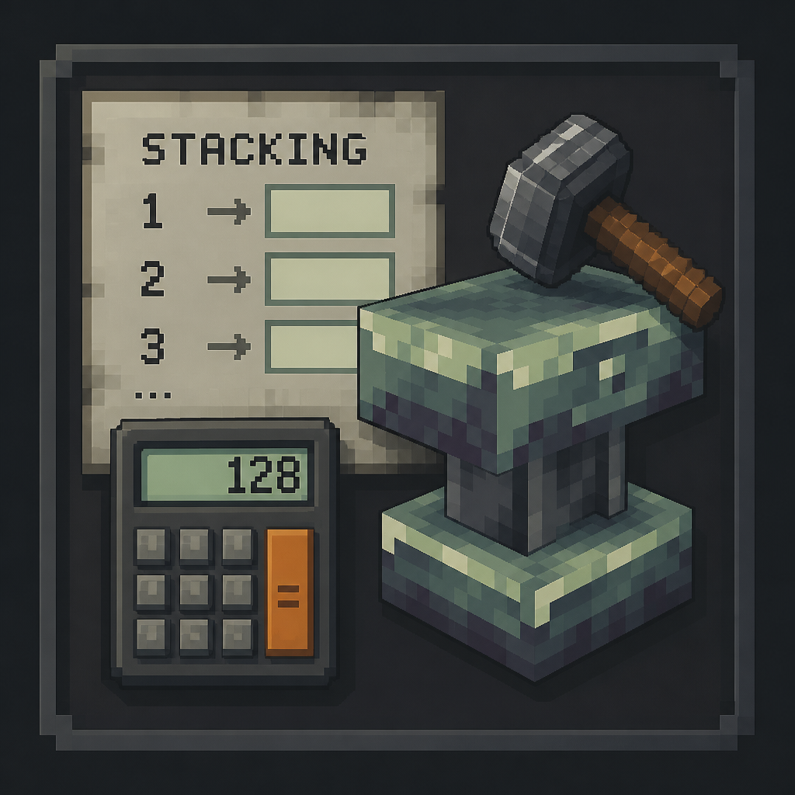

<div align="center">



# AnvilCraft Stack Calculator

</div>

《铁砧工艺》方块最密堆积计算器。它为以下结构计算满足六面衰变规则的布局，并尽量减少昂贵的隔离材料：

- 虚空物质块、负物质块与虚空能收集器。
- 钚块、铅块与集热器。

支持不堆积、平面堆积和立体堆积，提供真实方块模型的 Three.js 预览、X/Y/Z 分层视图、材料统计和坐标复制。

## 当前规则

- 基础单元为 `5 x 5 x 5`，中心坐标放置设备。
- 主材料不能被六个同类主材料正交包围。
- 平面模式为 `m x 1 x n` 个基础单元，立体模式为 `l x m x n` 个基础单元。
- 求解器使用 HiGHS 0-1 MILP。只有证明最优时才显示“已证明最优”；达到时限的结果显示“可行方案”。
- 当前界面限制平面模式每个可变方向最多 4 个单元，立体模式每个方向最多 2 个单元。

游戏规则版本元信息目前记录为 Minecraft 1.21.1 / AnvilCraft 1.6 开发分支。钚块规则仍需按最终目标版本复核。

## 开发

需要 Node.js 和 pnpm。

```bash
pnpm install
pnpm dev
```

默认开发地址为 `http://localhost:5173/`。

## 验证

```bash
pnpm test:run
pnpm build
pnpm test:e2e
```

浏览器端到端检查使用 Playwright：

```bash
pnpm exec playwright install chromium
```

## 许可证

项目代码采用 LGPL-3.0-only。AnvilCraft 模型和纹理的许可信息见 [ASSETS_LICENSE](./ASSETS_LICENSE)。
